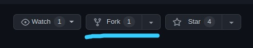
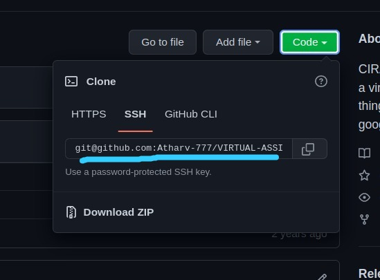
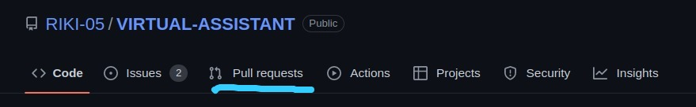
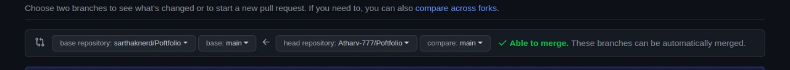
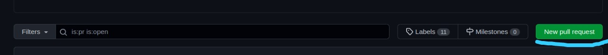

# Poftfolio
Portfolio Website

#### Want to contribute?
1. Fork this repo. You can fork the repo by clicking "fork" button on top-right corner.
<p align="left"></p>

2. Clone it on your local machine by simply clicking green "code" button and copying the given link.
<p align="left"></p>

Copy this link and open command prompt and switch to the location you want to save the project and run 
```git clone <copied link here>```

3. Add your changes or features.

4. Before pushing the code run following command to avoid merge conflicts
``` bash
git remote add upstream https://github.com/sarthaknerd/Poftfolio.git
git fetch upstream
git pull upstream master
```
5. Stage all the changes using ```git add .```

6. Add commit message ```git commit -m "<your message here>"``` and push the code using ```git push <remote name> <branch name>```

7. Then go to the main repo from where the project is forked and go into **Pull Request** tab.
<p align="left"></p>

8. Select the branch from forked repo you have contributed to and want to merge to the main repo.
<p align="left"></p>

9. Click create **Creating a pull request** and request for new PR.
<p align="left"></p>

And bam!:fire: thats it.
